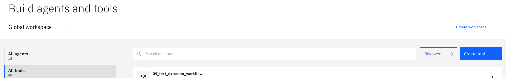
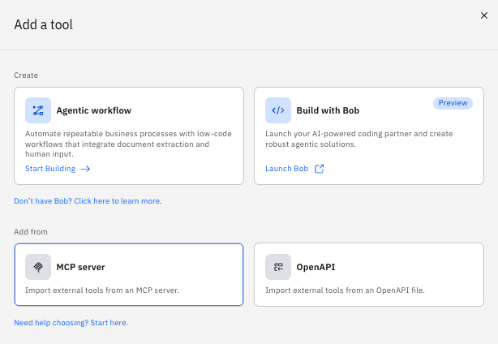
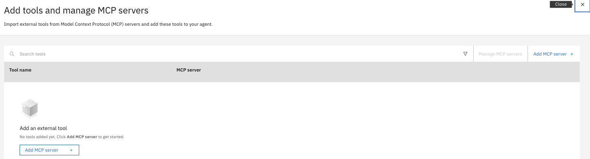
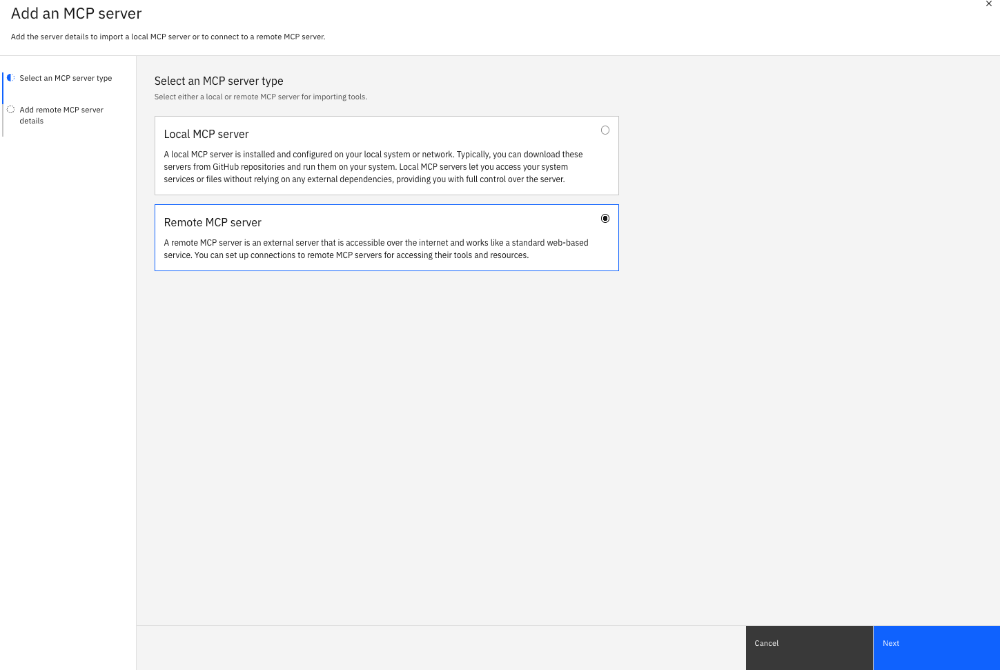
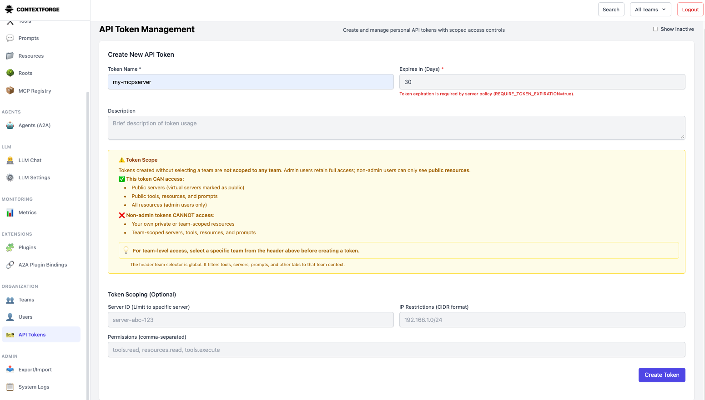
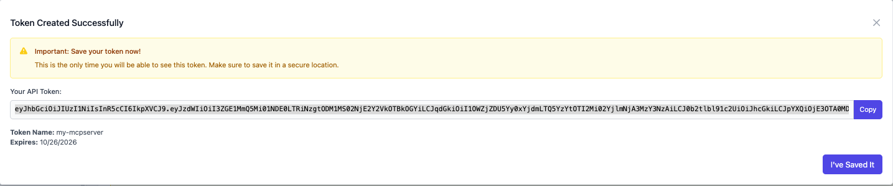
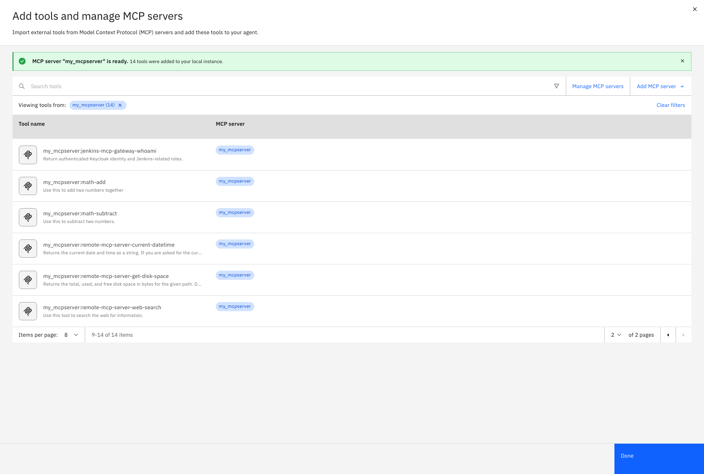

# Create key connection for mcp server
```bash
orchestrate connections add -a my_mcpserver
```


```bash
orchestrate connections configure \
  -a my_mcpserver \
  --env draft \
  --type team \
  --kind bearer
```  

```bash
orchestrate connections set-credentials \
  -a my_mcpserver \
  --env draft \
  --token "${MCP_TOKEN}"
```

# UI 
All tools > Create tool


Add a tool > MCP server


Add tools and manage MCP servers > Add MCP server


Add an MCP server > Remote MCP server 











# toolkit
## Add tool
- Add all tool
```bash
orchestrate toolkits add \
  --kind mcp \
  --name nexweb_mcp \
  --description "NEXWEB 원격 MCP 서버" \
  --url "http://nexweb.ddnsgeek.com:14444/servers/f50b2bab745f4e19a6396f578a390f58/mcp" \
  --transport "streamable_http" \
  --tools "*" \
  --app-id "my_mcpserver"
  ```

- Add selected tool
```bash
  orchestrate toolkits add \
  --kind mcp \
  --name nexweb_mcp \
  --description "NEXWEB 원격 MCP 서버" \
  --url "http://nexweb.ddnsgeek.com:14444/servers/f50b2bab745f4e19a6396f578a390f58/mcp" \
  --transport "streamable_http" \
  --tools "math-add" \
  --app-id "my_mcpserver"
  ```

## Remove tools
```bash
orchestrate toolkits remove -n nexweb_mcp
```