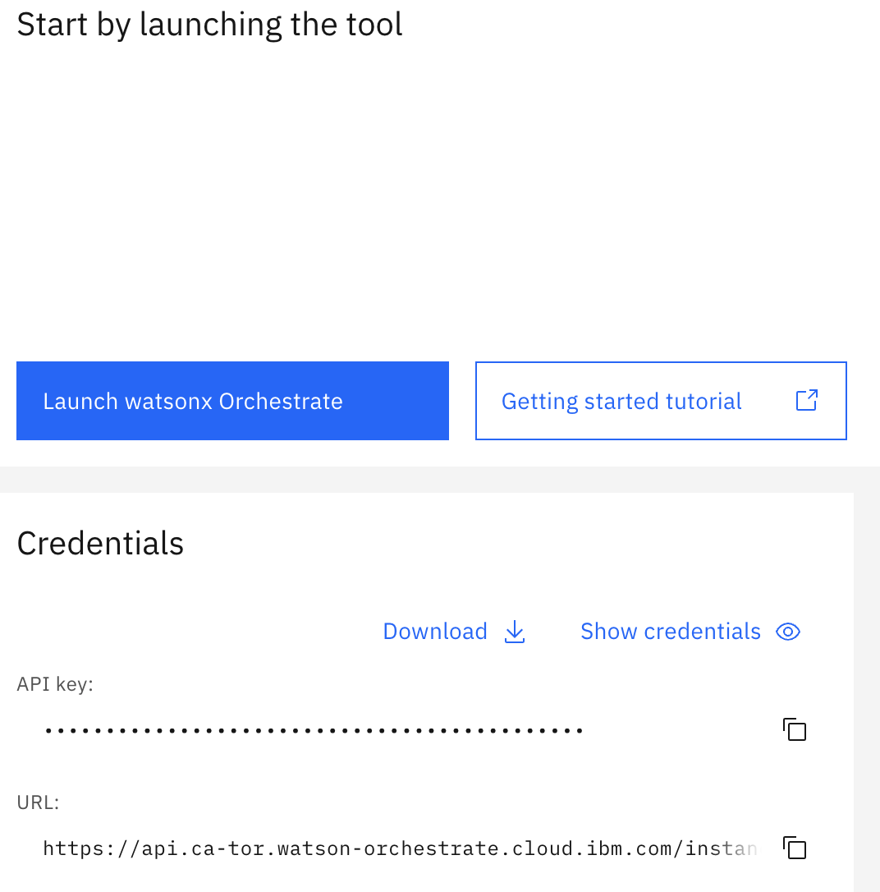

# pre-requisites

```bash
 python3 -m venv .venv
```
1. On macOS/Linux:
```bash
source .venv/bin/activate
```

2. On Windows:
```bash
venv\\Scripts\\activate
```

3. Install the ADK

With your virtual environment active, install the ADK:
```bash
pip install ibm-watsonx-orchestrate
pip install --upgrade pip
orchestrate –-help
```


orchestrate env add -n <environment-name> -u <Service-instance-url> 

orchestrate env add -n nexweb-env0924 -u https://api.ca-tor.watson-orchestrate.cloud.ibm.com/instances/3e60f36f-30f6-48a8-8360-a561b52b58b2 


4. activate env
```bash
orchestrate env activate nexweb-env0924
```

orchestrate env activate nexweb-env0924
Please enter WXO API key: 
[WARNING] - Using 'ibm_iam' Auth Type. If this is incorrect please use the '--type' flag to explicitly choose one of mcsp, mcsp_v1, mcsp_v2, cpd or k8s
[INFO] - Environment 'nexweb-env0924' is now active
[INFO] - Active workspace: Global workspace

# Add connection
## 1) 커넥션 애플리케이션 등록 
app-id는 db.py의 MYSQL_APP_ID와 반드시 동일해야 함

```bash
orchestrate connections add -a mysql_hr_demo
```
## 2) 종류 설정: key_value, team(공유) 또는 member(개인별)

```bash
orchestrate connections configure -a mysql_hr_demo --env draft  --kind key_value --type team
```
## 3) 자격증명 입력

- draft
```bash
orchestrate connections set-credentials -a mysql_hr_demo --env draft \
  -e MYSQL_HOST=localhost \
  -e MYSQL_PORT=3306 \
  -e MYSQL_USER=user01 \
  -e MYSQL_PASSWORD='abcd1234' \
  -e MYSQL_DATABASE=test
```  
