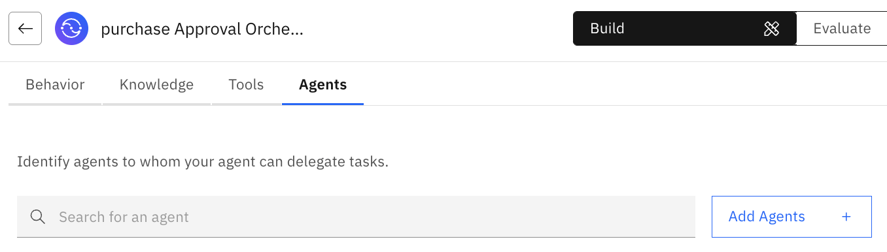
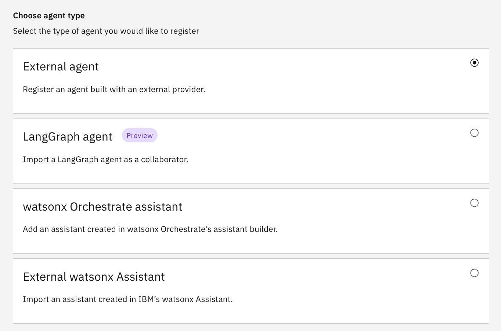
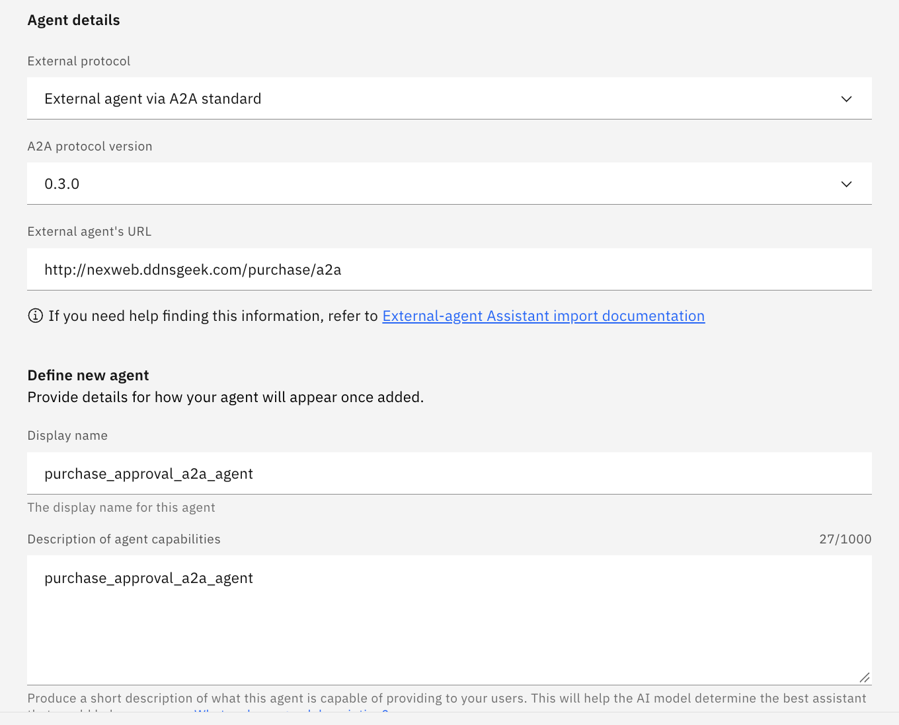
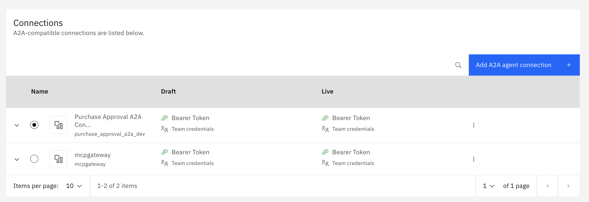

# External Agent 등록


1. Agents > Add Agent

## Agent Type > Agent details
Agent Type > Choose agent type

Add Agents > Import

Choose agent type
Select the type of agent you would like to register
External agent 선택

## Register > Agent details

Agent details : 
External protocol: External Agent via A2A standard
A2A protocol version : 0.3.0
External agent's URL : http://nexweb.ddnsgeek.com/purchase/a2a

Define new agent
Provide details for how your agent will appear once added.

Display name : purchase_approval_a2a_agent 

The display name for this agent
Description of agent capabilities
purchase_approval_a2a_agent

Connections
A2A-compatible connections are listed below.



2. A2A 정보 입력
```bash
Purpose:
Import for use and observability

External protocol:
External agent via A2A protocol

A2A protocol version:
0.3.0

Service instance URL:
http://nexweb.ddnsgeek.com/purchase/a2a

Display name:
purchase_approval_a2a_agent
```
3. Connection 단계
다음 화면에서 기존 Connection을 선택하거나 새로 만듭니다.   
```bash
Connection ID:
purchase_approval_a2a_connection

Display name:
Purchase Approval A2A Connection

Description:
구매 승인 A2A 에이전트 연결
```
## token 등록
```bash
orchestrate connections set-credentials \
  --app-id purchase_approval_a2a_dev \
  --env draft \
  --token "$A2A_BEARER_TOKEN"
```

## tool 등록
```bash
orchestrate tools import -k python -f leave_calculator.py
orchestrate tools list
```


## Agent 등록
```bash
orchestrate agents import -f leave_agent.yaml
```

## TOKEN
```bash
TOKEN=$(curl -s -X POST \
  --url https://iam.cloud.ibm.com/identity/token \
  --header "Content-Type: application/x-www-form-urlencoded" \
  --data "grant_type=urn:ibm:params:oauth:grant-type:apikey&apikey=${WXO_API}" \
  | python3 -c "import sys,json; print(json.load(sys.stdin)['access_token'])")
```

## Find Agents
```bash
API_ENDPOINT="https://api.ca-tor.watson-orchestrate.cloud.ibm.com/instances/6a4f1092-b48c-4340-8703-6b22d0c6821a"
curl -s --request GET \
  --url "${API_ENDPOINT}/v1/orchestrate/agents" \
  --header "Authorization: Bearer ${TOKEN}" \
  | jq .
```  

```bash
curl -s --request GET \
  --url "${API_ENDPOINT}/v1/orchestrate/agents" \
  --header "Authorization: Bearer ${TOKEN}" \
  | jq -r ".[].name"
```

# CLI만으로 agent_id 확인하기 (token 발급 없이)

굳이 raw API를 쓰지 않아도, CLI가 이미 인증을 갖고 있으니 이걸로도 충분합니다:
```bash
orchestrate agents list -v |grep -B2 '"name": "IBank"'
```

```bash
curl -s --request GET \
  --url "${API_ENDPOINT}/v1/orchestrate/agents" \
  --header "Authorization: Bearer ${TOKEN}" \
  | jq -r '.[] | select(.name == "Untitled_Agent_1_0708AT")'
```

```bash
AGENT_NAME="holiday"
AGENT_ID=$(curl -s --request GET \
  --url "${API_ENDPOINT}/v1/orchestrate/agents" \
  --header "Authorization: Bearer ${TOKEN}" \
  | jq -r '.[] | select(.name == "Untitled_Agent_1_0708AT") | .id')
```

```bash
API_ENDPOINT="https://api.ca-tor.watson-orchestrate.cloud.ibm.com/instances/6a4f1092-b48c-4340-8703-6b22d0c6821a"

curl --request PUT \
  --url "${API_ENDPOINT}/v1/orchestrate/agents/${AGENT_ID}/chat-starter-settings" \
  --header "Authorization: Bearer ${TOKEN}" \
  --header 'Content-Type: application/json' \
  --data '{
    "starter_prompts": {
      "customize": [
        {
          "title": "나의 연차는",
          "subtitle": "나의 연차를 확인해보세요",
          "prompt": "연차를 알려줘"
        } 
      ]
    },
    "welcome_content": {
      "welcome_message": "안녕하세요, 연차계산 Assistant입니다.",
      "description": "당신의 연차를 알려드립니다."
    }
  }'

  ```


  ## nginx
  ```
  현재 외부 A2A 주소를 /hello/a2a로 유지하려면, Nginx가 그 요청을 앱 내부 /로 전달하도록 설정하세요.

location = /hello/a2a {
    proxy_pass http://127.0.0.1:8020/;
    proxy_http_version 1.1;
    proxy_set_header Host $host;
    proxy_set_header X-Real-IP $remote_addr;
    proxy_set_header X-Forwarded-For $proxy_add_x_forwarded_for;
    proxy_set_header X-Forwarded-Proto $scheme;
}
```

## .env
```ini
HELLO_AGENT_HOST=0.0.0.0
HELLO_AGENT_PORT=8020
AGENT_PUBLIC_URL=http://localhost:8020
#AGENT_PUBLIC_URL=http://localhost:8020/
ROOT_PATH=/hello
# 비워두면 인증 없음. 값을 넣으면 Authorization: Bearer <값> 을 검사합니다.
A2A_AUTH_TOKEN=qwer1234567890
```