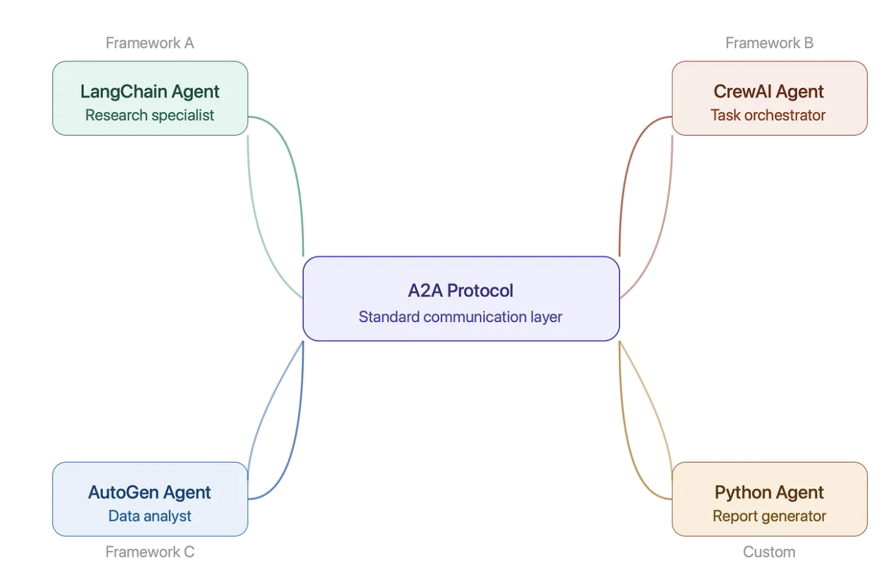
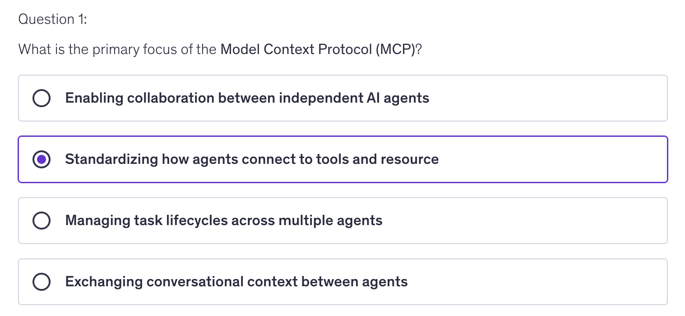
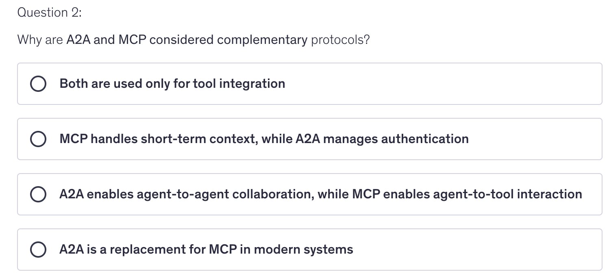
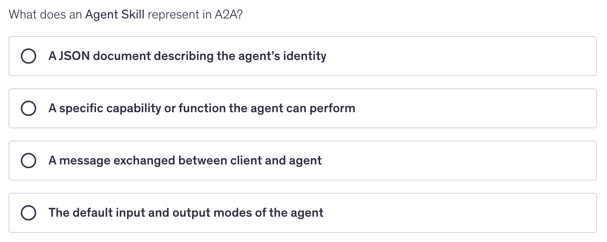

최근 멀티 에이전트 시스템을 구축해 본 적이 있다면, 아마 다른 모든 사람들이 겪는 것과 똑같은 난관에 부딪혔을 것입니다.  
바로 LangChain 에이전트와 CrewAI 에이전트가 서로 통신하려면 수많은 맞춤형 연결 코드를 직접 작성해야 한다는 점입니다.  
각 프레임워크는 저마다 고유한 언어를 사용하며, 이들을 하나로 엮는 일은 재 개발에 더 가깝게 느껴집니다.

**아무도 충분히 이야기하지 않는 문제**
오늘날 실제 엔터프라이즈급 다중 에이전트 시스템을 구축하려고 할 때 실제로 일어나는 일은 다음과 같습니다.

LangChain을 사용하여 연구용 에이전트를 구동합니다. 재무 팀은 AutoGen을 사용하여 데이터 분석 에이전트를 구축했습니다.  
또 다른 누군가는 일반 파이썬으로 보고서 생성 에이전트를 작성했습니다. 이제 이 세 가지 에이전트가 분기별 분석 작업에 협력해야 합니다.

어떻게 해야 할까요? 맞춤형 API 래퍼를 작성합니다. 자체 메시지 스키마를 정의합니다.  라우팅 계층을 구축합니다.  
각 에이전트의 작동 방식에 대한 가정을 하드코딩합니다. 6주 후, 기술적으로는 작동하는 시스템이 완성되지만, 이는 여러분이 직접 덕트 테이프로 땜질하고 밤을 새워가며 겨우 유지한 덕분일 뿐입니다.

이것이 바로 현재 다중 에이전트 AI의 현실입니다. 그리고 이는 팀들이 프로덕션 환경에서 에이전트 기반 워크플로를 확장하려고 할 때 심각한 병목 현상을 초래합니다.

**A2A 도입 전: 주요 문제점**
이 분야에 종사해 온 사람이라면 누구나 잘 알고 있는 핵심 문제들은 다음과 같습니다.

**프레임워크의 분산** — LangGraph, CrewAI, AutoGen, Haystack, 맞춤형 에이전트 등… 이들 모두 서로 다른 인터페이스, 서로 다른 작업 모델, 서로 다른 상태 처리 방식을 가지고 있습니다.

**밀접한 결합(Tight Coupling)** — 두 에이전트를 통합하려면 양쪽 팀 모두 상대방의 내부 구조를 이해해야 합니다. 한쪽을 변경하면 다른 쪽이 제대로 작동하지 않을 위험이 있습니다.

**표준화된 탐색 기능 부재** — “무엇을 할 수 있나요?”라고 묻고, 구조화되고 기계가 읽을 수 있는 답변을 얻을 수 있는 보편적인 방법이 없습니다.

**벤더 종속성** — 한 프레임워크의 패턴을 기반으로 오케스트레이션 로직을 구축하면, 다른 프레임워크로 전환하는 것이 매우 어렵습니다.

**MCP와 A2A의 차이점은 무엇일까요?**

모델 컨텍스트 프로토콜(MCP)은 AI 에이전트가 파일 시스템, API, 데이터베이스, 검색 기능 등의 도구와 리소스에 접근할 수 있도록 하는 것입니다. 즉, 도구에서 에이전트로의 프로토콜입니다.

A2A는 근본적으로 다릅니다. A2A는 에이전트끼리 소통하는 것을 다루며, 작업을 위임하고, 워크플로우에서 협업하며, 독립적으로 배포된 시스템 간에 기능을 연동하는 것을 목표로 합니다.

| 구분 | MCP (Model Context Protocol) | A2A (Agent-to-Agent Protocol) |
|---|---|---|
| 초점 | Tool과 Agent 간 연결 | Agent 간 연결 |
| 목적 | 외부 리소스에 접근 | 다른 Agent에 작업 위임 |
| 예시 | “이 계산기를 사용해 주세요.” | “이 하위 작업을 처리해 주세요.” |
| 범위 | 단일 Agent의 기능 확장 | 여러 Agent 간 오케스트레이션 |
| 상호작용 | Agent ↔ Tool/Resource | Agent ↔ Agent |
| 결과 | Agent가 데이터, Tool 또는 기능을 얻음 | 여러 Agent가 협업하고 작업을 위임해 함께 목표를 달성함 |

이 둘은 경쟁 관계가 아닙니다. 서로를 보완하는 관계입니다.  정교한 에이전트는 MCP를 사용하여 도구에 접근하고, A2A를 통해 하위 작업을 전문 에이전트에게 위임할 수 있습니다. 사실 이것이 바로 의도된 아키텍처입니다.

A2A는 도대체 무엇일까요?

A2A(Agent2Agent)는 AI 에이전트가 서로를 발견하고, 소통하며, 작업을 위임하는 방식을 표준화하는 개방형 프로토콜로, 해당 에이전트가 어떤 프레임워크로 구축되었는지와 무관합니다.

이를 에이전트 협업을 위한 HTTP라고 생각하면 됩니다.  HTTP가 서로의 내부 구조를 알 필요 없이 모든 브라우저가 어떤 웹 서버와도 통신할 수 있게 해주는 것처럼,  A2A는 공유된 계약을 통해 모든 에이전트가 다른 에이전트와 소통할 수 있게 해줍니다.

핵심 개념:

**표준화된 탐색** — 에이전트는 구조화된 “에이전트 카드”를 통해 수행 가능한 작업을 알립니다.
**통합된 작업 모델** — 작업에는 제출 → 진행 중 → 완료(또는 실패)라는 정의된 라이프사이클이 있습니다.
**스트리밍 지원** — 장시간 실행되는 작업은 중간 결과를 호출자에게 스트리밍으로 전송할 수 있습니다.
**프레임워크 독립적** — HTTP/JSON을 기반으로 구축되어 있으므로, 어떤 언어나 프레임워크에서도 구현할 수 있습니다.

다음은 다중 에이전트 흐름이 어떻게 보일 수 있는지에 대한 간단한 예시입니다:

## 참조
- [A2A sample](https://github.com/a2aproject/a2a-samples)
- [Agent2Agent (A2A) Protocol Explained: Building Interoperable AI Agents with Python](https://medium.com/@anilnishad19799/agent2agent-a2a-protocol-explained-building-interoperable-ai-agents-with-python-a3fbe60aacb1)

